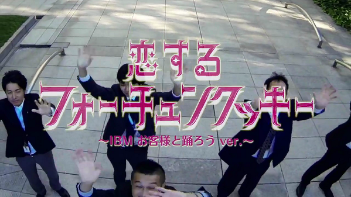

### Sou Ebina
　　

### skills summary

- 8 years experience in developing web-based applications  
  _Languages:_ C, C++, Java, PHP, Perl  
  _Databases:_ Oracle, PostgreSQL  
  _Systems:_ Unix, Linux, Windows, Apache Tomcat  
- 2 years experience in Technical Sales
- 10 years experience in B2B Tech Marketing,including 2 years experience as Cloud Field Marketer  
  * Marketing Strategies & Campaigns  
  * Product Positioning & Branding  
  * New Product Launch  
  * Signature event project management
  * Web & Print Content Development    

### Representative Projects (2000 to 2016)

[Digital Network MP3 Test-Listening System](http://www.atmarkit.co.jp/flinux/jirei/pioneer/pioneer_jirei.html)
(2000)  
  

- _Role:_ Server-Side Application development
- _Objectives:_ Introduced and operated new computerized system for Digital Network MP3 test-listening service with Pioneer Corporation.  
- _Results:_ The Japan first large-scale system development reference to adapt Linux as primary operating system for mission critical system.

[TV-Asahi corp. CMS renewal project](http://www.itmedia.co.jp/enterprise/articles/0503/22/news118.html)
(2004)  
  

- _Role:_ Application Development Team Leader
- _Objectives:_ Project aimed to integrate digital data broadcasting system with an existing web site,scattered customer data as well.  
- _Results:_ Whole system was safely launched in June 2004 with flexibility and agility.The first case in Japanese B2C website to adapt PHP for primary language.

[Oracle OpenWorld Tokyo 2012](http://www.fujitsu.com/jp/products/computing/servers/unix/sparc-enterprise/events/oracle-ow/2012/correspondent/)
(2012)  
  

- _Role:_ Project Manager
- _Objectives:_ Promote Oracle Japan Business vision and brand leadership through 3 Day Conference.The world's first conference that connects Tokyo and Kyoto via satellite.
- _Results:_ 15,000+ attendees with 100 Direct Opportunities,$35M business pipeline 

[some more funny videos!](https://www.youtube.com/watch?v=QOyrynZq_0I/)  

[“Fortune Cookie in Love” video promotion](https://www.youtube.com/watch?v=URLrRwlu6qI)
(2013)  
  

- _Role:_ Producer
- _Objectives:_ Develop new/deeper relationship with IT startup company’s Executives through new and novel approach, to create new demand and revenue opportunities in white market.
- _Results:_ No.3 Total PV ranking in IBM Japan (942,584 PVs/as of Mar8,2017)

[Watson on IBM Cloud Digital promotion](https://www.ibm.com/cognitive/jp-ja/cloud-for-cognitive/?S_PKG=&cm_mmc=Search_Google-_-9.1+MO+Mktg+Plan+Unknown_CA+Cloud-_-JP_JP-_-IBM+%E3%82%AF%E3%83%A9%E3%82%A6%E3%83%89_Broad_&cm_mmca1=000004QF&cm_mmca2=00000000&mkwid=8dbe2077-1563-4ff3-a8d2-75b2667c0fe0%7C620%7C13884)
(2016)   
  

- _Role:_ Project Manager
- _Objectives:_ Promote Watson and IBM Cloud Business vision and brand leadership through integrated digital campaign.The first large-scale collaboration with the publicity team to make large impact to the market.
- _Results:_ Effectively formulates strategies, tactics, and action plans to drive results. Exceeded the original goal of Web visits to campaign landing page by 140% (data as of Dec4,2016)  

<!-- ga beacon -->

